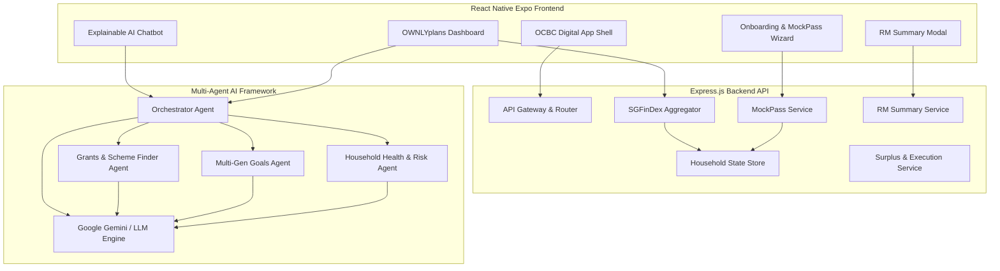

# Requirements

### Overview & Goals
OWNLYplans is an AI-powered family financial engine embedded within the OCBC Digital ecosystem. It unifies household finances, life milestones, Singapore government support schemes, and OCBC banking products into an adaptive, explainable, and human-in-the-loop financial cockpit.

The primary goal of this prototype is to prove technical and product feasibility of:
1. **Frictionless Onboarding & Aggregation**: Using **MockPass** (Singpass/MyInfo simulation) and **SGFinDex** to aggregate multi-bank accounts, CPF (OA/SA/MA), HDB housing eligibility, and family profiles without manual data entry.
2. **Multi-Agent Financial Intelligence**: Orchestrating 4 specialized AI agents (Goals, Grants, Health, and Orchestrator) to generate hyper-personalized, progressive financial plans.
3. **"We Guide. You Decide."**: Delivering explainable next-best actions with confidence scores and user-controlled autonomy levels (Notify & Wait, 24h Window, Full Auto).
4. **"Stay Connected" RM Handoff**: Context-rich household financial summary export for OCBC Relationship Managers with granular privacy consent.

---

### Scope
#### In Scope
- **Backend Service Layer**:
  - Express.js API engine with modular architecture.
  - **MockPass Engine**: Singpass authentication & MyInfo persona generator (Alex & Mary Tan, Sandwiched Generation Family, Single Achiever).
  - **SGFinDex Aggregation Engine**: Multi-bank (OCBC, DBS, UOB), CPF, and IRAS mock data pipelines.
  - **Multi-Agent Framework**:
    - *Household Health Agent*: Emergency fund, debt service ratio, protection gap analysis.
    - *Multi-Generational Goals Agent*: BTO downpayment, child education, retirement compounding.
    - *Grants & Scheme Finder Agent*: CPF Housing Grants, Baby Bonus/CDA, GST Voucher, Silver Support.
    - *Orchestrator & Explainable AI Agent*: Synthesis, Next-Best Action generation, impact simulation.
  - **Surplus Auto-Routing & Execution Engine**: High-yield cash sweeps (LionGlobal SGD MMF, OCBC 360) and goal funding rules.
  - **RM Summary Export**: Structured summary generator with consent flags.
- **Frontend Integration**:
  - Connect React Native Expo screens to backend endpoints.
  - Dynamic MockPass login flow & persona switcher.
  - Real-time multi-agent reasoning visualizer.
  - Interactive AI chatbot with household context.

#### Out of Scope
- Direct production integration with live GovTech Singpass OIDC servers or MAS SGFinDex production gateway (mocked via standard OpenAPI schemas).
- Live bank transaction settlement (simulated with ledger balance updates).

---

### User Stories
- **US1 (Household Financial View)**: As a Singaporean banking customer (e.g. Mary/Alex), I want to link my partner and view our consolidated household assets, CPF accounts, and liabilities in one place, so that we make informed joint decisions.
- **US2 (Grant Discovery)**: As a young couple planning for a BTO flat and baby, I want OWNLYplans to automatically discover eligible government grants (CPF Housing Grant, Baby Bonus) so that we never leave public benefits unclaimed.
- **US3 (Progressive Next-Best Actions)**: As a busy parent, I want clear, explainable AI recommendations with transparent trade-offs and confidence scores, so that I stay in full control of my family's money.
- **US4 (Surplus Auto-Optimization)**: As a household manager, I want idle cash in low-interest accounts to be automatically routed to high-yield instruments (LionGlobal SGD MMF) while funding our BTO pot.
- **US5 (Relationship Manager Handoff)**: As a customer needing complex wealth advice, I want to export a clean, consent-filtered household snapshot to my OCBC RM so our conversation starts with full context.

---

### Functional Requirements
- **FR1 (Authentication & MockPass)**: Provide `/api/auth/mockpass` with persona switching, returning Singpass NRIC, verified status, and MyInfo demographic/family data.
- **FR2 (SGFinDex Aggregation)**: Provide `/api/sgfindex/aggregate` returning structured multi-bank accounts, CPF breakdown (OA, SA, MA), SRS, and investments.
- **FR3 (Multi-Agent Analysis)**: Provide `/api/agents/analyze` triggering the 4 agents in parallel, returning findings, confidence scores, and action plans.
- **FR4 (Explainable AI Chatbot)**: Provide `/api/agents/chat` responding to natural-language user queries grounded in real household financial context.
- **FR5 (Surplus Route Execution)**: Provide `/api/finance/approve-plan` and `/api/finance/routes` to simulate capital allocation across accounts and goal pots.
- **FR6 (RM Brief Generation)**: Provide `/api/rm/household-summary` to generate exportable RM briefings.

---

### Non-Functional Requirements
- **Performance**: Agent analysis response generated in < 3s (with cached or parallel LLM calls).
- **Explainability**: Every recommendation must include reasoning ("Why this action?") and source data linkage.
- **Security & Privacy**: Support granular consent toggles and simulate PDPA-compliant masked data.

# Gap Analysis & Status

### Current Codebase Audit

#### 1. Backend Architecture (`/backend`)
- **Current State**:
  - Single Express server entry point (`backend/server.js`) with 3 basic endpoints:
    - `/api/ai-insights`: Basic Gemini prompt execution.
    - `/api/sgfindex/aggregate`: Minimal static bank/CPF accounts.
    - `/api/auth/mockpass`: Static single-user response.
  - `backend/routes/finance.js`: Static financial metrics and allocation routes.
  - `backend/routes/config.js`: App configuration route (defined but never registered in `server.js`).
- **Gaps Identified**:
  - **No Multi-Agent Framework**: All AI logic is bundled into a generic prompt rather than the 4 specialized agents defined in the white paper (Goals, Grants, Health, Orchestrator).
  - **Static MockPass**: No persona selection (young couple, sandwiched family, pre-retiree) or MyInfo household schema.
  - **Hardcoded Network Configuration**: `server.js` logs `192.168.1.5:5000` while `frontend/src/constants/appConfig.ts` uses `localhost:5000`.
  - **No Session / Household State Store**: Changes made in onboarding or configuration do not persist across requests.
  - **Missing RM Handoff Pipeline**: No endpoint or model for generating Relationship Manager briefings.

#### 2. Frontend Architecture (`/frontend`)
- **Current State**:
  - Comprehensive React Native Expo application with extensive UI screens:
    - `HomeScreen`, `UserProfile`, `TermsAndConditions`, `PlanLandingPage`.
    - Guided flow: `Screen1_anomaly` -> `Screen2_allocationFlow` -> `Screen3_agentStatux` -> `Screen4_GoalSelect` -> `Screen5_Waiting` -> `Screen6_PlannerConfig` -> `Screen7_PlannerLoading` -> `Screen8_PlannerOutput`.
    - Dashboard & Prototype: `AIPlanDashboard`, `whatever.tsx` (`OwnlyScreen`), `ChatbotOverlay`, `HelpPortal`, `BottomNav`.
- **Gaps Identified**:
  - **Frontend-Backend Disconnect**: Most screens render static constants from `frontend/src/constants/mockData.ts` rather than fetching dynamic state from the backend.
  - **MockPass UI Flow**: No interactive MockPass Singpass login/QR simulation in the frontend UI.
  - **Hardcoded Agent Reasoning**: `Screen3_agentStatux.tsx` and `agentOrchestration.tsx` render static checkmarks rather than reflecting real agent findings and confidence ratings.
  - **Chatbot Context**: `ChatbotOverlay.tsx` uses a local pre-set array of responses instead of querying the backend AI agent endpoint.

---

### Improvement Roadmap
1. **Transform Backend into a True Multi-Agent Micro-Engine**: Refactor `backend/` into clean modules (`/agents`, `/services`, `/routes`, `/models`, `/data`).
2. **Elevate MockPass & SGFinDex to Enterprise Prototypes**: Provide rich Singpass/MyInfo personas with realistic CPF, HDB BTO eligibility rules, and family member graphs.
3. **Full Integration Loop**: Connect all frontend wizard steps, dashboards, and the chatbot directly to the backend multi-agent APIs.

# Technical Design

### Architecture Overview



---

### Key Decisions
1. **Specialized Multi-Agent AI Architecture**:
   - *Decision*: Split AI processing into 4 modular agents (`HealthAgent`, `GoalsAgent`, `GrantsAgent`, `OrchestratorAgent`) orchestrated sequentially or in parallel, with structured JSON schemas.
   - *Rationale*: Matches the enterprise design in the white paper; provides clear separation of concerns (e.g. government scheme rules vs insurance gap calculations) and produces explainable justifications.
2. **MockPass & MyInfo Simulation**:
   - *Decision*: Implement a dedicated `MockPass` service with pre-configured personas (Young Couple with BTO, Sandwich Generation with Elderly Parents & Kids, Emerging Affluent).
   - *Rationale*: Singpass/MyInfo requires government credentials in production; MockPass enables frictionless end-to-end prototyping while preserving authentic Singapore data structures (NRIC, CPF OA/SA/MA, HDB grants).
3. **Household State Persistence**:
   - *Decision*: Implement an in-memory/JSON store with RESTful state updates so partner linking, goals, and approved allocations persist across user sessions.
   - *Rationale*: Eliminates hardcoded screen state and allows realistic multi-user simulation (e.g. Mary and Alex collaborating on shared goals).
4. **Resilient LLM + Rule-Based Hybrid**:
   - *Decision*: Implement deterministic calculation engines for Singapore financial rules (CPF interest, BTO downpayment formulas, CDA matching) paired with LLM synthesis for natural language explanations.
   - *Rationale*: Ensures 100% mathematical accuracy while providing rich, empathetic, and explainable advice.

---

### Data Models & Contracts

#### 1. MockPass Persona (`/api/auth/mockpass`)
```json
{
  "nric": "S****123A",
  "name": "Alex Tan",
  "partner": {
    "name": "Mary Lim",
    "nric": "S****456B",
    "linked": true
  },
  "household": {
    "segment": "25–44 Dual Income",
    "dependents": 1,
    "housingType": "4-Room BTO (Pending)",
    "monthlyIncome": { "self": 5500, "partner": 4800 },
    "cpfBalances": {
      "self": { "oa": 42000, "sa": 28000, "ma": 18000 },
      "partner": { "oa": 38000, "sa": 22000, "ma": 16000 }
    }
  }
}
```

#### 2. Multi-Agent Analysis Response (`/api/agents/analyze`)
```json
{
  "householdId": "hh-tan-2025",
  "health": {
    "score": 82,
    "monthlySurplus": 1340,
    "emergencyBufferMonths": 4.5,
    "protectionGap": 160000,
    "findings": ["Idle cash earning 0.05% p.a.", "S$160K joint life protection gap"]
  },
  "goals": [
    {
      "id": "bto-downpayment",
      "name": "BTO 4-Room Key Collection",
      "target": 60000,
      "current": 40800,
      "deadline": "2027-12",
      "onTrack": true
    }
  ],
  "grants": [
    {
      "name": "Enhanced CPF Housing Grant (EHG)",
      "amount": 45000,
      "status": "Eligible - Unclaimed",
      "action": "Auto-apply via HDB Flat Portal integration"
    },
    {
      "name": "Baby Bonus CDA First Step Grant",
      "amount": 5000,
      "status": "Upcoming",
      "action": "Pre-register OCBC CDA account"
    }
  ],
  "nextBestActions": [
    {
      "id": "nba-1",
      "title": "Sweep Idle Cash to LionGlobal SGD MMF",
      "reason": "Increases annual yield from 0.05% to 3.85% p.a. (+S$38/mo net)",
      "confidence": 0.98,
      "category": "CASHFLOW",
      "impact": "+S$456/year"
    },
    {
      "id": "nba-2",
      "title": "Close S$160K Protection Gap with Great Eastern FlexiLife",
      "reason": "Secures family mortgage coverage for S$28/mo",
      "confidence": 0.94,
      "category": "PROTECTION",
      "impact": "100% Mortgage Protection"
    }
  ]
}
```

---

### File Structure & Changes

#### Backend Additions & Updates (`backend/`)
```
backend/
├── config/
│   └── env.js                     # Environment variables & constants
├── data/
│   ├── personas.json              # MockPass Singapore personas
│   ├── grantsCatalog.json         # Singapore government grant rules
│   └── productsCatalog.json       # OCBC & Great Eastern product specs
├── models/
│   └── householdStore.js          # In-memory/JSON household state store
├── agents/
│   ├── healthAgent.js             # Financial health & risk agent
│   ├── goalsAgent.js              # Multi-generational goals agent
│   ├── grantsAgent.js             # Grants & government schemes agent
│   └── orchestratorAgent.js       # Orchestrator & Explainable AI engine
├── services/
│   ├── mockpass.js                # Singpass / MyInfo authentication service
│   ├── sgfindex.js                # SGFinDex multi-bank & CPF aggregator
│   ├── plannerService.js          # Surplus allocation & milestone calculator
│   └── rmExportService.js         # Relationship manager summary exporter
├── routes/
│   ├── auth.js                    # MockPass auth endpoints
│   ├── sgfindex.js                # SGFinDex data endpoints
│   ├── agents.js                  # Multi-agent analysis & chat endpoints
│   ├── finance.js                 # Household overview & surplus execution
│   └── rm.js                      # RM briefing export endpoint
├── tests/
│   ├── agents.test.js             # Unit & integration tests for agents
│   └── api.test.js                # API endpoint tests
└── server.js                      # Express application entry point
```

#### Frontend Updates (`frontend/src/`)
- `services/api.ts`: Centralized API service interacting with backend endpoints.
- `constants/appConfig.ts`: Dynamically configure backend host (`http://localhost:5000` or LAN IP).
- `components/Screen3_agentStatux.tsx` & `components/agentOrchestration.tsx`: Render dynamic agent findings, confidence scores, and reasoning.
- `components/Screen8_PlannerOutput.tsx` & `components/whatever.tsx`: Bind to backend generated Next-Best Actions and surplus distribution.
- `components/chatbotoverlay.tsx`: Stream responses from `/api/agents/chat`.
- `components/userProfile.tsx`: Add MockPass persona switcher.

# Testing

### Validation Approach
Verification of the OWNLYplans prototype spans:
1. **API & Service Testing**: Validating MockPass authentication, SGFinDex aggregation, and surplus routing endpoints.
2. **Multi-Agent AI Verification**: Ensuring each agent (Health, Goals, Grants, Orchestrator) produces structured, mathematically accurate, and explainable recommendations.
3. **End-to-End User Journeys**: Validating the flow from MockPass login through goal configuration, agent execution, plan approval, and RM export.

---

### Key Scenarios
1. **MockPass Singpass Login & SGFinDex Sync**:
   - Verify persona switching (e.g. Alex & Mary Tan vs Single Professional).
   - Ensure CPF (OA/SA/MA), OCBC 360, DBS, and UOB balances correctly aggregate into household net worth.
2. **Multi-Agent Analysis & Grant Discovery**:
   - Trigger 4 agents on a dual-income BTO family.
   - Verify identification of Enhanced CPF Housing Grant (EHG) and Baby Bonus CDA.
   - Verify emergency fund ratio and Great Eastern protection gap calculations.
3. **Surplus Auto-Routing Execution**:
   - Test monthly surplus allocation (e.g. S$1,340) split between LionGlobal SGD MMF (yield lift) and BTO Goal Pot.
   - Verify execution state and simulated account balance updates.
4. **Explainable AI Chatbot Interaction**:
   - Ask contextual questions (e.g., *"Why should we allocate S$1,000 to MMF?"*, *"How does the BTO timeline affect our emergency fund?"*).
   - Verify that AI answers cite real user balances, grant rules, and confidence ratings.
5. **Relationship Manager (RM) Brief Generation**:
   - Toggle privacy permissions (hide sensitive personal accounts, share joint assets).
   - Verify generated RM briefing summary includes family goals, protection gaps, and grant opportunities.

---

### Test Changes
- Add `backend/tests/api.test.js`: Comprehensive integration tests covering `/api/auth/mockpass`, `/api/sgfindex/aggregate`, `/api/agents/analyze`, `/api/finance/overview`, and `/api/rm/summary`.
- Add `backend/tests/agents.test.js`: Unit tests for agent rule engines, grant eligibility logic, and prompt generators.

# Delivery Steps

### ✓ Step 1: Stage 1: Architect Backend Core, MockPass & SGFinDex Service Engines
A robust, modular backend foundation with environment config, session/household state store, and structured MockPass + SGFinDex integration.

- Create centralized configuration (`backend/config/env.js`) and error handling middleware.
- Build MockPass authentication module (`backend/services/mockpass.js`, `backend/routes/auth.js`) supporting multiple Singaporean household personas (e.g., Alex & Mary Tan - Young Married Couple, Sandwiched Family, Pre-retirees) with realistic Singpass/MyInfo payloads (NRIC, income, CPF balances, HDB housing data, dependents).
- Build SGFinDex aggregation engine (`backend/services/sgfindex.js`, `backend/routes/sgfindex.js`) aggregating multi-bank accounts (OCBC, DBS, UOB), CPF accounts (OA, SA, MA), SRS, and investments (SGX/Robo).
- Implement an in-memory / JSON-backed Household State Store (`backend/models/householdStore.js`) to persist partner invitations, linked accounts, and shared budgets.

### ✓ Step 2: Stage 2: Implement Multi-Agent Financial Intelligence Engine
A 4-agent backend framework powered by Google Gemini / LLM with deterministic fallbacks that analyzes household finances across distinct dimensions.

- Implement **Household Health & Risk Agent** (`backend/agents/healthAgent.js`): evaluates emergency buffer, debt-to-income ratio, savings rate, and protection gap (Great Eastern term/life).
- Implement **Multi-Generational Goals Agent** (`backend/agents/goalsAgent.js`): optimizes timelines and monthly surplus splits for BTO downpayment, education funds, and retirement milestones.
- Implement **Grants & Government Benefits Agent** (`backend/agents/grantsAgent.js`): identifies Singapore government grants (Enhanced CPF Housing Grant, Baby Bonus/CDA, GST Voucher, Silver Support, Climate Vouchers).
- Implement **Orchestrator & Explainable AI Agent** (`backend/agents/orchestratorAgent.js`): synthesizes agent insights into prioritized Next-Best Actions with confidence scores, step-by-step rationales, and impact simulations.
- Expose `/api/agents/analyze` and `/api/agents/chat` routes with streaming/SSE or structured JSON output (`backend/routes/agents.js`).

### ✓ Step 3: Stage 3: Build Surplus Routing, Autonomous Modes & RM Advisory Handoff
End-to-end endpoints for household cashflow management, surplus auto-routing, and RM advisory export.

- Implement Progressive Financial Planning & Rebalancing service (`backend/services/plannerService.js`, `backend/routes/finance.js`) calculating optimal surplus distribution across high-yield savings (OCBC 360), LionGlobal MMF, and goal pots.
- Build Governance & Safety Guardrails module enforcing drawdown caps, execution limits, and multi-factor approval checks.
- Implement RM Household Summary Export engine (`backend/services/rmExportService.js`, `backend/routes/rm.js`): generates structured, consent-filtered PDF/JSON briefs for OCBC Relationship Managers with family context, asset breakdown, and identified gaps.
- Mount and register all routes in `backend/server.js` with comprehensive health checks (`/api/health`) and OpenAPI-compatible schemas.

### ✓ Step 4: Stage 4: Bridge React Native Frontend with Backend Multi-Agent APIs
Frontend screens seamlessly communicate with the backend MockPass, SGFinDex, and Multi-Agent APIs.

- Refactor API client service (`frontend/src/services/api.ts`) with typed endpoints and configurable base URL.
- Wire MockPass Singpass login and persona switcher modal into `UserProfile.tsx` and onboarding flow (`frontend/src/app/index.tsx`).
- Connect real backend multi-agent evaluation to `Screen3_agentStatux.tsx`, `agentOrchestration.tsx`, and `Screen7_PlannerLoading.tsx` with live reasoning step updates.
- Connect `Screen8_PlannerOutput.tsx`, `AIPlanDashboard.tsx`, and `whatever.tsx` (`OwnlyScreen`) to dynamic backend plan generation, surplus routes, and next-best actions.
- Connect `ChatbotOverlay.tsx` to `/api/agents/chat` with dynamic conversation history and household context awareness.

### ✓ Step 5: Stage 5: End-to-End Household Flow Validation, RM Handoff & Documentation
Complete end-to-end user journeys validated and documented.

- Validate the full onboarding flow: MockPass Singpass login -> Household Profile -> Partner Linking -> 4-Agent Execution -> Plan Generation -> Plan Approval & Execution.
- Test edge cases: singles vs dual-income households, zero surplus, protection deficits, and grant eligibility triggers.
- Verify Relationship Manager (RM) summary generation with privacy permissions toggle.
- Create automated integration tests (`backend/tests/api.test.js`, `backend/tests/agents.test.js`) and provide comprehensive prototype documentation (`README.md` and API specs).