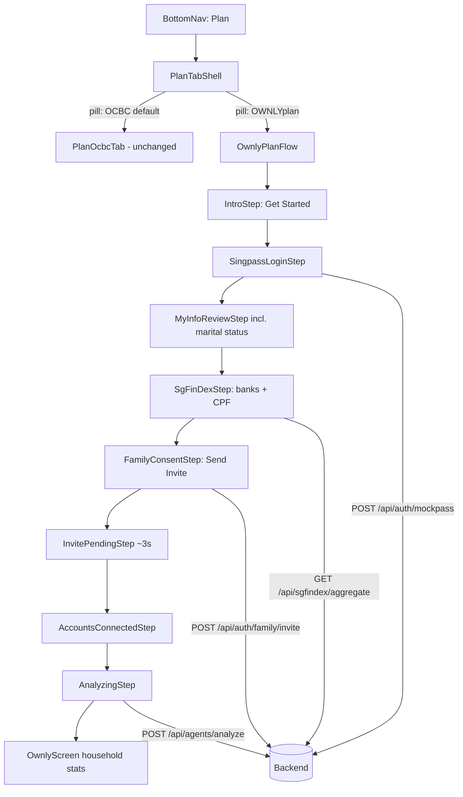

# Requirements

### Overview & Goals
The backend engine (MockPass, SGFinDex, 4-agent framework, planner, RM export) is already built and working. What is broken is the **user journey**: the Plan tab drops the user straight into an "AI Life Planner" start page, the wizard chain in `app/index.tsx` mixes screens that no longer belong together, and there is no visible Singpass sign-in or family/bank consent flow.

This change **restructures the Plan interface only**. Everything OWNLYplans does now lives behind a single **`OWNLYplan` pill** inside the Plan tab of the bottom nav. The `OCBC` pill stays exactly as it is today.

Goals:
1. Make the Plan tab landing match the uploaded reference screenshot — same layout, same `OCBC` pill selected by default, with `Financial OneView` renamed to **`OWNLYplan`**.
2. Give the `OWNLYplan` pill a proper cold-start state: a short "what this feature is" label plus a **Get Started** button.
3. Show a coherent, demo-friendly onboarding journey: **Singpass (MockPass) sign-in → SGFinDex bank linking → family (spouse/children) consent → "Send Invite" → 3s wait → "Accounts Connected" → Start Family Planning**.
4. After setup, the `OWNLYplan` pill shows the populated household cockpit with real backend stats.
5. Collapse the prototype to **one family persona** — Alex Tan & Mary Lim (4-Room BTO, one infant). Multi-persona switching, the sandwiched-generation persona and the single/unmarried persona are removed, since the product story is family-centric.
6. Remove screens that break the narrative from the navigation flow.

---

### Scope

#### In Scope
- **Plan tab shell**: new pill row (`OCBC`, `OWNLYplan`) rendered inside the Plan tab, styled like the existing pill row in `homescreen.tsx`.
- **`OCBC` pill**: renders the current Plan tab content unchanged (default selected).
- **`OWNLYplan` pill**: hosts the entire OWNLYplans feature — cold start, onboarding flow, and post-setup household view.
- **New onboarding steps** (all auto-filled for demo speed, but each step is *visible* to the user):
  - Feature intro + `Get Started`
  - Singpass / MockPass sign-in — always resolves the single family persona `alex_mary_bto`, no persona picker
  - SGFinDex consent + bank linking (OCBC, DBS, UOB, CPF) using `/api/sgfindex/aggregate`
  - Family linking — spouse + children derived from the Singpass marital status / dependents (always present for the family persona), with an explicit permission request and a `Send Invite` action
  - 3-second pending state → `Accounts Connected` confirmation
  - `Start Family Planning` → agent run → populated cockpit
- **Flow controller**: new `OwnlyPlanFlow.tsx` owning its own step state (confirmed choice).
- **Single-persona cleanup**: reduce `backend/data/personas.json` to `alex_mary_bto` only, simplify the persona endpoints, and remove the persona switcher UI from `userProfile.tsx`.
- **Retire from navigation** (files kept in repo): `Screen1_anomaly`, `Screen2_allocationFlow`, `PlanLandingTab`, `PlanLandingPage`, and the standalone `dashboard` screen route.

#### Out of Scope
- Multi-persona demo switching, the sandwiched-generation persona and the single/unmarried persona.
- Any change to the Home tab (`homescreen.tsx`), Rewards, More, or Pay & Transfer.
- Backend changes beyond small additive endpoints needed for the invite/consent step.
- Real Singpass OIDC or real SGFinDex — MockPass simulation only.
- Deleting legacy component files.

---

### User Stories
- **US1**: As a user opening the **Plan** tab, I see the familiar OCBC layout with `OCBC` selected, and a new `OWNLYplan` pill next to it, so the feature feels native to the app.
- **US2**: As a first-time user tapping `OWNLYplan`, I see a short explanation of what OWNLYplans does and a single `Get Started` button, so I am not overwhelmed.
- **US3**: As a user starting onboarding, I sign in with **Singpass** (MockPass) as Alex Tan and see my verified identity, marital status, income and CPF pulled in automatically, so I do not type anything or pick a persona.
- **US4**: Because Singpass shows my **marital status**, I am next asked to connect my **other banks (SGFinDex)** and my **spouse and children**, so the plan covers the whole household.
- **US5**: As a user linking family members, the app asks for **their** permission and stops at **`Send Invite`** — I do not silently pull their data.
- **US6**: After sending invites I see a brief pending state, and about **3 seconds** later it flips to **`Accounts Connected`**, so the demo flows without waiting.
- **US7**: Once connected, I tap **Start Family Planning** and the OWNLYplan pill fills with my household stats, agent findings, grants and next-best actions.
- **US8**: As a returning user, tapping `OWNLYplan` goes straight to the populated household view — no repeated onboarding.

---

### Functional Requirements

**FR1 — Plan tab pill row**
- Renders exactly two pills: `OCBC` (default active) and `OWNLYplan`.
- Visual treatment matches the existing pill row: active = red `#D81E05` filled with white text, inactive = white with `#E0E0E0` border and `#666666` text.
- Switching pills does not reset the OWNLYplan flow state.

**FR2 — Cold start**
- When no household setup exists, the `OWNLYplan` pill shows: feature title, 2–3 line description of what OWNLYplans is, 3 highlight rows, and a `Get Started` CTA.

**FR3 — Singpass (MockPass) sign-in**
- Shows a Singpass-styled screen with the red/white Singpass affordance and a "Log in with Singpass" action.
- On tap, calls `POST /api/auth/mockpass` with no persona argument — the backend always resolves the single family persona `alex_mary_bto` (Alex Tan & Mary Lim). No persona picker is rendered.
- On success shows the retrieved MyInfo card: name, masked NRIC, citizenship, **marital status**, employment, income, CPF OA/SA/MA — all read-only and auto-filled.

**FR4 — SGFinDex bank linking**
- Lists the institutions to be connected (OCBC, DBS, UOB, CPF Board, IRAS) each with a checkbox pre-ticked.
- A `Retrieve with Singpass` action calls `GET /api/sgfindex/aggregate` and shows the aggregated balances that came back.

**FR5 — Family linking & consent**
- Pre-populates spouse and children from the MockPass response (`partner`, `dependents`).
- Each member row shows name, relationship, masked NRIC and a consent toggle stating that the member must approve.
- Primary CTA is **`Send Invite`** (disabled if no member is selected). The family persona always yields a spouse (Mary Lim) and a child (Ethan Tan), so no empty state is required.

**FR6 — Pending → Connected**
- After `Send Invite`, shows a pending state per member ("Awaiting approval…").
- After ~3 seconds each flips to `Approved`, and the screen resolves to a **`Accounts Connected`** confirmation summarising members linked and accounts aggregated.
- CTA becomes **`Start Family Planning`**.

**FR7 — Agent run & populated view**
- `Start Family Planning` triggers `POST /api/agents/analyze` with a visible agent progress state (Health, Goals, Grants, Orchestrator).
- On completion the `OWNLYplan` pill renders the populated household cockpit (existing `OwnlyScreen` content): health score, household stats, agent findings, grants, next-best actions, surplus routes, autonomy mode, RM handoff.

**FR8 — Single family persona**
- `backend/data/personas.json` contains only `alex_mary_bto`; `sandwich_family` and `single_achiever` are deleted.
- `GET /api/auth/personas` returns a single-item list; `POST /api/auth/switch-persona` becomes a no-op that always resolves `alex_mary_bto`.
- `userProfile.tsx` no longer renders a persona switcher — it shows the fixed household identity instead.

**FR9 — Retired screens**
- `Screen1_anomaly`, `Screen2_allocationFlow`, `PlanLandingTab`, `PlanLandingPage` and the `dashboard` screen key are no longer reachable from navigation. Files remain on disk.

---

### Non-Functional Requirements
- **Demo speed**: no step requires typing and no persona has to be chosen; every field is auto-filled. Total journey from `Get Started` to populated view is under ~30 seconds.
- **Resilience**: if the backend is unreachable, each step falls back to persona data bundled in `mockData.ts` so the demo never dead-ends.
- **Consistency**: all new screens reuse the OCBC palette (`#D81E05`, `#F5F3EF`, `#1A1A1A`, `#EAEAEA`) already used across `homescreen.tsx` and `whatever.tsx`.

# Technical Design

### Current Implementation

- **`frontend/src/app/index.tsx`** — the whole app is one component driving a flat `screen` string (`home` | `ownly` | `dashboard` | `plan`) plus a linear `onboardingStep` chain: `landing → terms → profile → planning → agent-status → waiting → config → loading → output`. `nav()` has a special case that redirects `plan` to `dashboard` once `hasApprovedPlan` is true. This is the root cause of the inconsistent journey.
- **`frontend/src/components/PlanLandingPage.tsx`** — current Plan entry: "AI Life Planner" hero + `START`. No pill row, no OCBC content.
- **`frontend/src/components/PlanLandingTab.tsx`** — dead code. Exports `PlanLandingTab` and `AIPlannerFlow` but every sub-screen (`PlannerTerms`, `PlannerProfile`, …) is an empty `<View />` placeholder. Never imported.
- **`frontend/src/components/homescreen.tsx`** — contains the pill row pattern to copy: local `FilterTabs` (lines ~212–243) with styles `tabsSection`, `privacyToggle`, `tabPill`, `tabPillActive`, `tabPillText`, `tabPillTextActive`.
- **`frontend/src/components/whatever.tsx`** (`OwnlyScreen`) — the finished OWNLYplans cockpit, already calling `api.analyzeAgents()`, autonomy `MODES`, `PROMOS`, routes, RM modal. Currently reachable only via the Home hero banner (`screen === 'ownly'`).
- **`frontend/src/components/AIPlanDashboard.tsx`** — separate dashboard reached via the `dashboard` screen key after plan approval; duplicates much of `OwnlyScreen`.
- **`frontend/src/services/api.ts`** — complete typed client: `mockpassLogin`, `getPersonas`, `switchPersona`, `linkPartner`, `getSgFinDexAggregate`, `analyzeAgents`, `sendChatMessage`, `getFinanceOverview`, `generatePlan`, `approvePlan`, `executeRoute`, `exportRMSummary`.
- **Backend** — `backend/routes/auth.js` (`/mockpass`, `/personas`, `/switch-persona`, `/partner/link`), `backend/routes/sgfindex.js` (`/aggregate`), plus `agents`, `finance`, `rm` routes. `backend/data/personas.json` currently holds three personas (`alex_mary_bto`, `sandwich_family`, `single_achiever`), each with `partner`, `dependents`, `housing`, `accounts`. `backend/config/env.js` already defaults to `DEFAULT_PERSONA: 'alex_mary_bto'` and `householdStore.js` seeds `activePersonaId` to the same value, so collapsing to one persona is low-risk.
- **`frontend/src/components/userProfile.tsx`** — contains the persona switcher list wired to `api.getPersonas()` / `api.switchPersona()`; this is the only UI surface exposing multi-persona selection.

### Key Decisions

1. **Feature is confined to the `OWNLYplan` pill.** The Plan tab becomes a shell with a pill row; the `OCBC` pill keeps today's content untouched. Rationale: matches the reference screenshot and keeps the demo story tight — "we only added one pill".
2. **Dedicated flow controller (`OwnlyPlanFlow.tsx`) owns its own step state.** `app/index.tsx` is reduced to top-level tab routing. Rationale: the current `onboardingStep` chain in `index.tsx` is the source of the inconsistency; isolating it makes the journey self-contained and re-enterable.
3. **One family persona only.** `personas.json` is trimmed to `alex_mary_bto`; `sandwich_family` and `single_achiever` are removed, and the persona-switching UI in `userProfile.tsx` is dropped. Rationale: the product narrative is explicitly family-centric, and this single household (dual income, BTO pending, one infant, S$160K protection gap, EHG + Baby Bonus eligible) already exercises every agent path — extra personas only add branching with no demo value.
4. **Onboarding order is driven by the Singpass payload.** Because MockPass returns marital status / `partner` / `dependents`, the family-linking step is presented as a *consequence* of sign-in, not an arbitrary wizard step. With a single married persona this branch is now guaranteed, so the flow has no conditional skip.
5. **Consent is explicit but simulated.** The flow stops at `Send Invite` and only resolves after a 3-second timer — no data is shown as "pulled" before approval. Rationale: honours "We Guide. You Decide." while staying demo-fast.
6. **`OwnlyScreen` becomes the post-setup body of the pill**, replacing the standalone `dashboard` route. `AIPlanDashboard` is dropped from navigation but the file stays.
7. **Setup completion is persisted in flow state** (`householdConnected`), so returning to the pill skips onboarding.

### Proposed Changes

**New — `frontend/src/components/plan/PlanTabShell.tsx`**
- Renders the Plan tab header + pill row (`OCBC`, `OWNLYplan`).
- Holds `activePill` state; renders `PlanOcbcTab` or `OwnlyPlanFlow`.

**New — `frontend/src/components/plan/PlanOcbcTab.tsx`**
- The existing OCBC Plan content, extracted unchanged so the pill row can switch to it.

**New — `frontend/src/components/plan/OwnlyPlanFlow.tsx`**
- Owns `step` state and the collected `householdContext`.
- Steps: `intro | singpass | myinfo | sgfindex | family | invited | connected | analyzing | cockpit`.
- Persists `householdConnected` so re-entry jumps to `cockpit`.

**New step screens under `frontend/src/components/plan/steps/`**
- `IntroStep.tsx` — feature label + `Get Started`.
- `SingpassLoginStep.tsx` — Singpass-styled login, no persona picker; calls `api.mockpassLogin()` which resolves the single family persona.
- `MyInfoReviewStep.tsx` — read-only auto-filled MyInfo card incl. marital status.
- `SgFinDexStep.tsx` — institution checklist; calls `api.getSgFinDexAggregate()`.
- `FamilyConsentStep.tsx` — spouse/children rows with consent toggles; CTA `Send Invite`; calls `api.linkPartner()`.
- `InvitePendingStep.tsx` — 3s timer, per-member "Awaiting approval → Approved".
- `AccountsConnectedStep.tsx` — confirmation + `Start Family Planning`.
- `AnalyzingStep.tsx` — agent progress; calls `api.analyzeAgents()`.

**Modified — `frontend/src/app/index.tsx`**
- Reduce to tab routing: `home | plan | rewards | more`.
- Remove `onboardingStep`, `goToNext`, `goToBack`, `goToOnboarding`, `handleConfigComplete`, the `dashboard` screen key and the `nav('plan') → dashboard` redirect.
- Render `<PlanTabShell />` for `screen === 'plan'`; keep `BottomNav`, `HelpPortal`, `ChatbotOverlay`.

**Modified — `frontend/src/components/BottomNav.tsx`**
- Ensure `plan` stays highlighted for all OWNLYplan sub-steps (no more `dashboard` special case).

**Modified — `frontend/src/constants/mockData.ts`**
- Add offline fallbacks for the new steps: `FALLBACK_MYINFO`, `FALLBACK_FAMILY_MEMBERS`, `FALLBACK_SGFINDEX_INSTITUTIONS` — all keyed to the Alex & Mary household.
- Remove any persona-list constants used by the retired persona switcher.

**Modified — `frontend/src/components/userProfile.tsx`**
- Remove the persona switcher block and the `api.getPersonas()` / `api.switchPersona()` calls.
- Render the fixed household identity (Alex Tan, masked NRIC, "Married — household of 3") instead.

**Modified — `backend/data/personas.json`**
- Delete the `sandwich_family` and `single_achiever` entries, leaving `alex_mary_bto` as the sole persona.

**Modified — `backend/services/mockpass.js` / `backend/routes/auth.js`**
- `POST /api/auth/mockpass` ignores any `personaId` in the body and always resolves `alex_mary_bto`.
- `GET /api/auth/personas` returns the single-item list; `POST /api/auth/switch-persona` becomes a no-op returning `alex_mary_bto`.

**Modified — `frontend/src/services/api.ts`**
- `mockpassLogin()` takes no persona argument; `getPersonas` / `switchPersona` are retained only for backwards compatibility or removed if unused after the `userProfile.tsx` cleanup.

**Backend — `backend/routes/auth.js`** (additive)
- `POST /api/auth/family/invite` — accepts `{ members: [{ name, relation, nric }] }`, records consent-pending entries in `householdStore`, returns `{ success, invitedAt, members }`.
- `GET /api/auth/family/status` — returns members with `status: 'PENDING' | 'APPROVED'`, auto-approving after the simulated delay so the frontend timer has a real source of truth.

### Data Models / Contracts

```ts
// OwnlyPlanFlow step machine
type OwnlyStep =
  | 'intro' | 'singpass' | 'myinfo' | 'sgfindex'
  | 'family' | 'invited' | 'connected' | 'analyzing' | 'cockpit';

interface FamilyMember {
  id: string;
  name: string;
  relation: 'Spouse' | 'Child' | 'Parent';
  maskedNric: string;
  selected: boolean;
  status: 'IDLE' | 'PENDING' | 'APPROVED';
}

interface HouseholdContext {
  personaId: 'alex_mary_bto';   // single family persona
  myInfo: MockPassAuthResponse | null;
  aggregate: any | null;          // GET /api/sgfindex/aggregate
  family: FamilyMember[];
  analysis: AgentAnalysisData | null;
  householdConnected: boolean;
}
```

```jsonc
// POST /api/auth/family/invite
{ "members": [{ "name": "Mary Lim", "relation": "Spouse", "nric": "S****456B" }] }
// ->
{ "success": true, "invitedAt": "...", "members": [{ "name": "Mary Lim", "status": "PENDING" }] }
```

### Components

| Component | Status | Change |
|---|---|---|
| `app/index.tsx` | modified | stripped to tab routing |
| `plan/PlanTabShell.tsx` | new | pill row + pill routing |
| `plan/PlanOcbcTab.tsx` | new | existing OCBC content, unchanged |
| `plan/OwnlyPlanFlow.tsx` | new | step machine for the journey |
| `plan/steps/*` | new | 8 step screens |
| `whatever.tsx` (`OwnlyScreen`) | reused | becomes the `cockpit` step body |
| `BottomNav.tsx` | modified | drop `dashboard` special case |
| `mockData.ts` | modified | offline fallbacks, persona list removed |
| `userProfile.tsx` | modified | persona switcher removed, fixed household identity |
| `backend/data/personas.json` | modified | trimmed to `alex_mary_bto` |
| `backend/services/mockpass.js` | modified | always resolves the single family persona |
| `PlanLandingPage.tsx`, `PlanLandingTab.tsx`, `Screen1_anomaly.tsx`, `Screen2_allocationFlow.tsx`, `AIPlanDashboard.tsx` | retired | removed from navigation, files kept |

### File Structure

```
frontend/src/
├── app/index.tsx                     # MODIFIED - tab routing only
├── components/
│   ├── plan/
│   │   ├── PlanTabShell.tsx          # NEW
│   │   ├── PlanOcbcTab.tsx           # NEW
│   │   ├── OwnlyPlanFlow.tsx         # NEW
│   │   └── steps/
│   │       ├── IntroStep.tsx             # NEW
│   │       ├── SingpassLoginStep.tsx     # NEW
│   │       ├── MyInfoReviewStep.tsx      # NEW
│   │       ├── SgFinDexStep.tsx          # NEW
│   │       ├── FamilyConsentStep.tsx     # NEW
│   │       ├── InvitePendingStep.tsx     # NEW
│   │       ├── AccountsConnectedStep.tsx # NEW
│   │       └── AnalyzingStep.tsx         # NEW
│   ├── whatever.tsx                  # REUSED as cockpit
│   ├── BottomNav.tsx                 # MODIFIED
│   └── userProfile.tsx               # MODIFIED - persona switcher removed
├── constants/mockData.ts             # MODIFIED - fallbacks, persona list removed
└── services/api.ts                   # MODIFIED - mockpassLogin() without persona arg
backend/
├── data/personas.json                # MODIFIED - only alex_mary_bto remains
├── services/mockpass.js              # MODIFIED - always resolves alex_mary_bto
└── routes/auth.js                    # MODIFIED - family invite/status, persona endpoints collapsed
```

### Architecture Diagram



### Risks
- **Regression in the OCBC pill** — mitigated by extracting the existing content verbatim into `PlanOcbcTab.tsx` with no styling changes.
- **Timer leaks on unmount** — the 3s invite timer must be cleared in a `useEffect` cleanup to avoid setting state on an unmounted step.
- **Backend unavailable on device** — every step needs a fallback path using `mockData.ts`, otherwise the iPhone/Expo demo dead-ends when the LAN IP in `appConfig.ts` is stale.
- **Dead imports** — removing screens from `index.tsx` must also remove their imports or the bundle keeps pulling in retired components.
- **Persona removal breaking existing tests** — `backend/tests/e2e.test.js` and `api.test.js` currently iterate over all three personas; those cases must be reduced to `alex_mary_bto` or they will fail once `personas.json` is trimmed.
- **Stale persona references** — `householdStore.js`, `env.js` and `api.ts` all mention persona switching; leaving a dangling `switchPersona('single_achiever')` call would return `null` and blank the cockpit.

# Testing

### Validation Approach
- Type-check the frontend with `npx tsc --noEmit` after each stage to catch broken props and removed imports.
- Exercise the new backend endpoints with the existing Jest suites in `backend/tests/`.
- Walk the full journey in Expo for the single family persona (Alex Tan & Mary Lim) and confirm every step renders and advances.

### Key Scenarios
1. **Plan tab landing** — opens with `OCBC` pill active and content identical to before; `OWNLYplan` pill visible beside it.
2. **Cold start** — tapping `OWNLYplan` with no setup shows the feature label and `Get Started`.
3. **Singpass sign-in** — `POST /api/auth/mockpass` with an empty body returns the Alex Tan MyInfo payload with marital status; the review card is fully auto-filled with no editable inputs and no persona picker is shown.
4. **SGFinDex** — institutions list resolves to aggregated OCBC/DBS/UOB/CPF balances.
5. **Family consent** — Mary Lim (Spouse) and Ethan Tan (Child) are pre-listed; `Send Invite` moves both to `Awaiting approval`.
6. **3-second resolution** — after ~3s both flip to `Approved` and `Accounts Connected` appears with `Start Family Planning`.
7. **Populated cockpit** — agent analysis completes and the pill body shows health score, grants and next-best actions.
8. **Re-entry** — leaving the Plan tab and returning goes straight to the cockpit.

### Edge Cases
- **Unknown persona requested** — `POST /api/auth/mockpass` or `switch-persona` with `sandwich_family` / `single_achiever` still resolves cleanly to `alex_mary_bto` instead of returning `null`.
- **Persona list endpoint** — `GET /api/auth/personas` returns exactly one entry and no UI attempts to render a switcher.
- **Backend down** — each step falls back to `mockData.ts` and the journey still completes.
- **Rapid pill switching** — toggling `OCBC` ↔ `OWNLYplan` mid-flow preserves the current step.
- **Retired screens** — no navigation path reaches `Screen1_anomaly`, `Screen2_allocationFlow`, `PlanLandingPage`, `PlanLandingTab` or the `dashboard` key.

### Test Changes
- Extend `backend/tests/api.test.js` with cases for `POST /api/auth/family/invite` and `GET /api/auth/family/status` (pending → approved transition), plus a case asserting `GET /api/auth/personas` returns a single family persona.
- Update `backend/tests/e2e.test.js` to drop the `sandwich_family` and `single_achiever` journeys and keep only the Alex & Mary household flow.